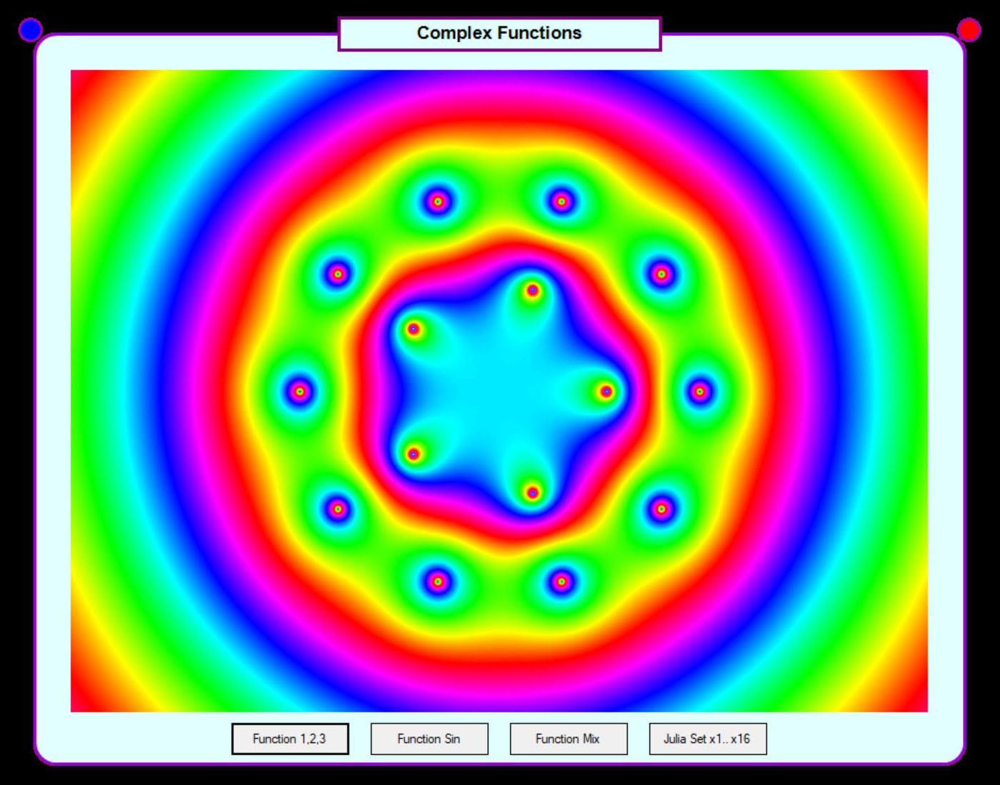

# Some Complex Functions
F(z)=((z^5-1)/(z^10-512))^2

F(z)=((z^5-1)/(z^10-512))^-2i

F(z)=((z^5-1)/(z^10-512))^(2-2i)

F(z)=sin(2πz)/z^3

F(z)=(z+i+1)^3*(z^2+1)*e^(3/z)/Y(z)
Y(z)=(z-1)^2*(z+1)

Julia Set:

Julia Set:

