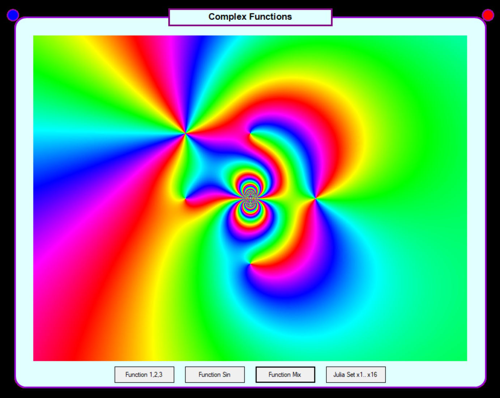
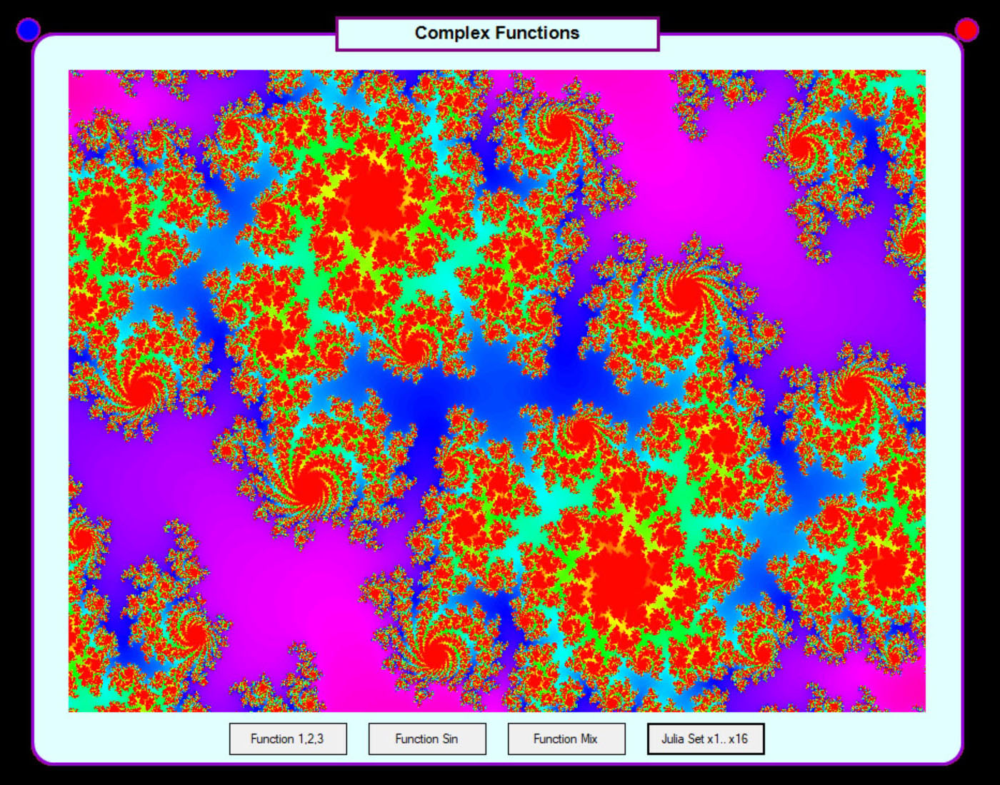

# Some Complex Functions
This repository contains visualizations of various complex functions using C#. 
The images illustrate the behavior of these functions in interval:
{z ∈ ℂ : -2 ≤ Re(z) ≤ 2, -2 ≤ Im(z) ≤ 2}

F(z)=((z^5-1)/(z^10-512))^2

F(z)=((z^5-1)/(z^10-512))^(-2i)

F(z)=((z^5-1)/(z^10-512))^(2-2i)

F(z)=sin(2πz)/z^3

$$F(z) = \frac{(z+i+1)^3 \cdot (z^2+1) \cdot e^{3/z}}{(z-1)^2 \cdot (z+1)}$$

Julia Set x1:

Julia Set x8:

